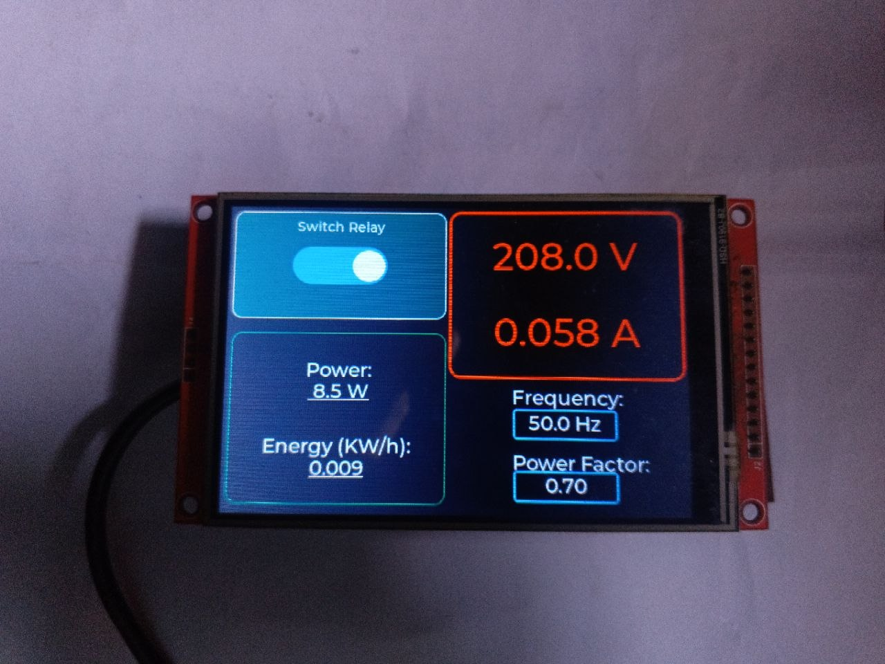

# PZEM004-MQTT-Monitoring-ST7796-Display

A complete, end-to-end IoT energy monitoring and control system utilizing two ESP32 microcontrollers communicating via a secure MQTT broker.

This system is divided into two parts:

1. **The Sensing Node (`sensing`):** Reads AC electrical data from a PZEM-004T (v3.0) module, publishes the data as JSON, and listens for relay control commands.
2. **The GUI Node (`gui`):** Features an LVGL-powered touch interface that subscribes to the sensors data for real-time visualization and provides a UI button to toggle the remote relay.

---



## ✨Features

- **Energy Monitoring:** Monitors real-time Voltage, Current, Power (W), Energy (kWh), Frequency (Hz), and Power Factor.
- **Remote Relay Control:** Bi-directional MQTT communication allows the GUI Node to seamlessly toggle a high-voltage relay connected to the Sensing Node.
- **Smooth UI (LVGL):** The GUI Node provides a responsive touch interface without freezing during network drops.

---

## 🛠 Hardware Requirements

### Node 1: Sensing & Relay Unit (`sensing`)

- **ESP32** Development Board
- **PZEM-004T (v3.0)** AC Energy Monitor
- **Relay Module** (Active HIGH)

| Component        | ESP32 Pin | Note                   |
| ---------------- | --------- | ---------------------- |
| **PZEM TX**      | `GPIO 16` | Hardware Serial 2 (RX) |
| **PZEM RX**      | `GPIO 17` | Hardware Serial 2 (TX) |
| **Relay Signal** | `GPIO 23` | Toggles the load       |

### Node 2: GUI Unit (`gui`)

- **ESP32** Development Board
- **TFT Display** (480x320) compatible with `TFT_eSPI`.
- **XPT2046 Touch Controller** (Touch CS pin configured to `GPIO 21`).

---

## 📦 Software Dependencies

You will need the following libraries installed in your PlatformIO environment:

**Shared Dependencies (Both Nodes):**

- `knolleary/PubSubClient`
- `bblanchon/ArduinoJson`

**Sensing Node Specific:**

- `mandulaj/PZEM-004T-v30`

**GUI Node Specific:**

- `bodmer/TFT_eSPI` (Configuring `User_Setup.h` via platformio.ini)
- `paulstoffregen/XPT2046_Touchscreen`
- `lvgl/lvgl` (Configuring `lv_conf.h` via platformio.ini)

---

## 🚀 Setup & Configuration

### 1. Network & Broker Settings

You must configure the exact same Wi-Fi and MQTT broker credentials in the main source files (`src/main.cpp`) for **both** nodes:

```cpp
const char* ssid = "<Network SSID>";
const char* password = "<Network Password>";

const char* mqtt_server = "<MQTT_Server>"; 
const int mqtt_port = 8883;                 //MQTT_PORT
const char* mqtt_user = "<MQTT_Username>";
const char* mqtt_pass = "<MQTT_Password>";
```
